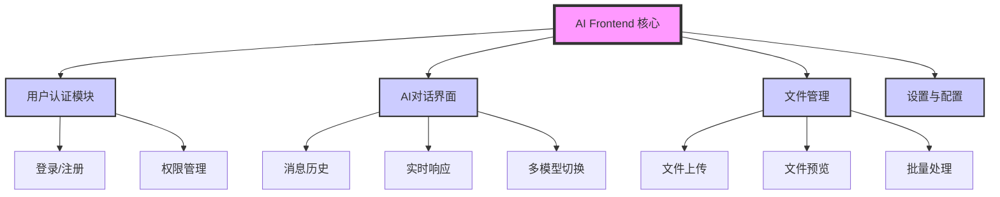

# 功能思维导图 / 功能文档

## 项目概述

**项目名称**：`ai-frontend`
**项目描述**：AI项目的前端界面，基于React + Vite + TypeScript + Tailwind CSS技术栈，提供用户友好的AI功能交互界面
**版本**：`1.0.0`
**最后更新**：`2026-03-20`

## 功能架构图



## 功能目录

### 核心功能

| 功能ID | 功能名称 | 状态 | 优先级 | 负责人 | 最后更新 |
|--------|----------|------|--------|--------|----------|
| `F-001` | `项目基础框架` | ✅ 已实现 | P0 | `系统` | `2026-03-20` |
| `F-002` | `用户认证系统` | 🚧 开发中 | P1 | `阿玮` | `2026-03-20` |
| `F-003` | `AI对话界面` | 📋 规划中 | P0 | `待分配` | `2026-03-20` |
| `F-004` | `文件管理模块` | 📋 规划中 | P2 | `待分配` | `2026-03-20` |
| `F-005` | `响应式布局` | 📋 规划中 | P1 | `待分配` | `2026-03-20` |

---

## 功能详情

### 功能ID: `F-001` - `项目基础框架`

#### 基本信息
- **功能名称**：`项目基础框架`
- **功能ID**：`F-001`
- **创建日期**：`2026-03-20`
- **最后更新**：`2026-03-20`
- **当前状态**：`✅ 已实现`
- **优先级**：`P0` (P0-关键, P1-高, P2-中, P3-低)
- **负责人**：`系统`

#### 功能描述
建立项目的基础技术栈和开发环境，为后续功能开发提供稳定基础。

**用户故事**：
> 作为 `开发者`，我希望 `拥有一个现代化的前端开发环境`，以便 `高效开发和维护AI前端应用`。

**验收标准**：
- [x] 使用React + TypeScript + Vite技术栈
- [x] 集成Tailwind CSS进行样式管理
- [x] 配置ESLint和代码规范
- [x] 建立项目目录结构
- [x] 实现基本的开发服务器和构建流程

#### 依赖关系

**上游依赖**（本功能依赖的其他功能/模块）：
| 依赖项 | 类型 | 描述 | 状态 |
|--------|------|------|------|
| `Node.js环境` | 环境依赖 | `Node.js v16+ 和 npm/yarn` | ✅ 就绪 |

**下游依赖**（依赖本功能的其他功能/模块）：
| 依赖项 | 类型 | 描述 | 状态 |
|--------|------|------|------|
| `所有其他功能` | 功能依赖 | `所有功能都依赖此基础框架` | 📋 规划中 |

#### 边界条件

**输入条件**：
- 输入类型：`无`
- 输入来源：`项目初始化`
- 输入验证：`无`
- 异常处理：`构建失败时提供清晰错误信息`

**输出条件**：
- 输出类型：`可运行的开发环境`
- 输出目标：`开发者`
- 输出验证：`通过npm run dev可启动开发服务器`

**限制条件**：
- 性能要求：`开发服务器启动时间 < 5秒`
- 资源限制：`内存使用合理`
- 安全要求：`遵循前端安全最佳实践`
- 兼容性要求：`支持现代浏览器(Chrome, Firefox, Safari最新版本)`

#### 技术实现

**实现方案**：
```bash
# 项目初始化命令
npm create vite@latest ai-frontend -- --template react-ts
npm install -D tailwindcss@^3.4.0 postcss autoprefixer
npx tailwindcss init -p
```

**关键组件**：
| 组件名称 | 职责 | 技术栈 |
|----------|------|--------|
| `Vite配置` | `构建工具和开发服务器` | `Vite` |
| `React应用` | `前端框架` | `React 19 + TypeScript` |
| `Tailwind CSS` | `样式系统` | `Tailwind CSS v3` |
| `ESLint` | `代码质量检查` | `ESLint` |

**配置项**：
| 配置键 | 默认值 | 描述 | 环境差异 |
|--------|--------|------|----------|
| `VITE_API_BASE` | `http://localhost:3000/api` | `API基础URL` | 生产环境使用实际API地址 |
| `VITE_APP_TITLE` | `AI Frontend` | `应用标题` | 无 |

#### 测试用例

**单元测试**：
- 测试场景1：`验证开发服务器可以正常启动`
- 测试场景2：`验证TypeScript编译无错误`

**集成测试**：
- 测试场景1：`验证Tailwind CSS类可以正确应用`
- 测试场景2：`验证热更新功能正常工作`

#### 变更历史

| 版本 | 日期 | 变更内容 | 变更人 |
|------|------|----------|--------|
| `v1.0.0` | `2026-03-20` | 初始版本创建 | `系统` |

#### 相关文档
- [ ] 设计文档：`FEATURE-MAP.md`
- [ ] API文档：`待创建`
- [ ] 测试报告：`待创建`
- [ ] 部署指南：`待创建`

---

### 功能ID: `F-002` - `用户认证系统`

#### 基本信息
- **功能名称**：`用户认证系统`
- **功能ID**：`F-002`
- **创建日期**：`2026-03-20`
- **最后更新**：`2026-03-20`
- **当前状态**：`🚧 开发中`
- **优先级**：`P1` (P0-关键, P1-高, P2-中, P3-低)
- **负责人**：`阿玮`

#### 功能描述
实现用户身份认证和权限管理功能，包括登录、注册、会话管理和权限控制。

**用户故事**：
> 作为 `用户`，我希望 `能够注册账号并登录系统`，以便 `访问个性化的AI功能并保护我的数据`。
> 作为 `管理员`，我希望 `能够管理用户权限`，以便 `控制不同用户对系统功能的访问`。

**验收标准**：
- [ ] 用户可以通过邮箱/密码注册新账号
- [ ] 用户可以通过邮箱/密码登录系统
- [ ] 登录状态可以持久化（例如通过token）
- [ ] 未登录用户访问受限页面时重定向到登录页
- [ ] 登录用户可以安全退出
- [ ] 用户密码安全存储（前端加密传输）
- [ ] 提供忘记密码功能（预留接口）
- [ ] 响应式设计，支持移动端和桌面端

#### 依赖关系

**上游依赖**（本功能依赖的其他功能/模块）：
| 依赖项 | 类型 | 描述 | 状态 |
|--------|------|------|------|
| `F-001` | 功能依赖 | `项目基础框架` | ✅ 已实现 |
| `后端认证API` | 外部依赖 | `提供用户认证的API接口` | 📋 待对接 |

**下游依赖**（依赖本功能的其他功能/模块）：
| 依赖项 | 类型 | 描述 | 状态 |
|--------|------|------|------|
| `F-003` | 功能依赖 | `AI对话界面需要用户认证` | 📋 规划中 |
| `F-004` | 功能依赖 | `文件管理需要用户权限` | 📋 规划中 |

#### 边界条件

**输入条件**：
- 输入类型：`用户凭证（邮箱、密码）`
- 输入来源：`登录/注册表单`
- 输入验证：`邮箱格式验证、密码强度验证`
- 异常处理：`网络错误、认证失败、输入无效时的友好提示`

**输出条件**：
- 输出类型：`认证状态、用户信息、错误信息`
- 输出目标：`前端界面、本地存储、后端API`
- 输出验证：`认证成功后可访问受限页面`

**限制条件**：
- 性能要求：`登录/注册请求响应时间 < 2秒`
- 资源限制：`本地存储空间合理使用`
- 安全要求：`密码加密传输、token安全存储、防止XSS/CSRF`
- 兼容性要求：`支持现代浏览器(Chrome, Firefox, Safari最新版本)`

#### 技术实现

**实现方案**：
```typescript
// 主要组件结构
src/
  ├── auth/
  │   ├── components/
  │   │   ├── LoginForm.tsx    # 登录表单
  │   │   ├── RegisterForm.tsx # 注册表单
  │   │   └── AuthGuard.tsx    # 路由守卫组件
  │   ├── contexts/
  │   │   └── AuthContext.tsx  # 认证上下文
  │   ├── services/
  │   │   └── authService.ts   # 认证API服务
  │   ├── types/
  │   │   └── auth.types.ts    # 类型定义
  │   └── utils/
  │       └── auth.utils.ts    # 认证工具函数
```

**关键组件**：
| 组件名称 | 职责 | 技术栈 |
|----------|------|--------|
| `AuthContext` | `全局认证状态管理` | `React Context + TypeScript` |
| `LoginForm` | `用户登录界面` | `React + Tailwind CSS + Formik/Yup` |
| `RegisterForm` | `用户注册界面` | `React + Tailwind CSS + Formik/Yup` |
| `AuthGuard` | `路由保护组件` | `React Router + 条件渲染` |
| `authService` | `认证API调用` | `Axios/Fetch + 错误处理` |

**配置项**：
| 配置键 | 默认值 | 描述 | 环境差异 |
|--------|--------|------|----------|
| `VITE_AUTH_API_BASE` | `http://localhost:3000/api/auth` | `认证API基础URL` | 生产环境使用实际API地址 |
| `VITE_TOKEN_KEY` | `ai_frontend_auth_token` | `本地存储token的键名` | 无 |

#### 测试用例

**单元测试**：
- 测试场景1：`验证邮箱格式验证函数`
- 测试场景2：`验证密码强度验证函数`
- 测试场景3：`验证AuthContext状态更新`

**集成测试**：
- 测试场景1：`验证登录表单提交流程`
- 测试场景2：`验证注册表单提交流程`
- 测试场景3：`验证路由保护功能`
- 测试场景4：`验证token存储和读取`

**端到端测试**：
- 测试场景1：`完整的用户注册流程`
- 测试场景2：`完整的用户登录流程`
- 测试场景3：`登录后访问受限页面`

#### 变更历史

| 版本 | 日期 | 变更内容 | 变更人 |
|------|------|----------|--------|
| `v1.0.0` | `2026-03-20` | 功能规划创建，开始开发 | `阿玮` |

#### 相关文档
- [ ] 设计文档：`FEATURE-MAP.md`
- [ ] API文档：`API_AUTH.md` (待创建)
- [ ] 测试报告：`TEST_AUTH.md` (待创建)
- [ ] 部署指南：`DEPLOYMENT.md` (待创建)

---

### 功能ID: `F-003` - `AI对话界面`
*[待详细规划]*

---

## 依赖关系矩阵

| 功能ID | F-001 | F-002 | F-003 | F-004 | F-005 |
|--------|-------|-------|-------|-------|-------|
| **F-001** | - | ✅ | ✅ | ✅ | ✅ |
| **F-002** | ✅ | - | 🔶 | 🔶 | 🔶 |
| **F-003** | ❌ | ✅ | - | 🔶 | 🔶 |
| **F-004** | ❌ | ✅ | 🔶 | - | 🔶 |
| **F-005** | ❌ | 🔶 | 🔶 | 🔶 | - |

**图例**：
- ✅：强依赖（必须存在）
- 🔶：弱依赖（可选依赖）
- ❌：无依赖

---

## 全局约束和约定

### 技术约束
1. **性能约束**：页面加载时间 < 3秒，API响应时间 < 500ms
2. **安全约束**：所有用户输入必须验证和转义，使用HTTPS
3. **兼容性约束**：支持Chrome、Firefox、Safari最新两个版本

### 业务约束
1. **合规性约束**：符合数据隐私法规要求
2. **审计约束**：用户操作记录审计日志
3. **可用性约束**：系统可用性目标99.5%

### 开发约定
1. **分支策略**：GitHub Flow
2. **提交规范**：遵循Conventional Commits
3. **代码审查**：至少需要一名审查者
4. **文档更新**：代码变更必须更新FEATURE-MAP.md
5. **响应式设计**：优先移动端，适配桌面端

---

## 维护指南

### 新增功能流程
1. 在"功能目录"中添加新行
2. 创建详细的功能详情章节
3. 更新依赖关系矩阵
4. 更新功能架构图

### 修改功能流程
1. 在功能详情的"变更历史"中添加记录
2. 更新相关字段（状态、描述等）
3. 同步更新依赖关系矩阵

### 废弃功能流程
1. 将状态改为"🗑️ 已废弃"
2. 记录废弃原因和替代方案
3. 在依赖关系矩阵中标记为废弃
4. 规划迁移和清理时间表

### 定期审查
- **每周**：更新功能状态和进度
- **每月**：审查依赖关系和边界条件
- **每季度**：整体架构和功能规划审查

---

## 附录

### 术语表
| 术语 | 定义 |
|------|------|
| `AI Frontend` | `AI项目的前端用户界面` |
| `Vite` | `现代化的前端构建工具` |
| `Tailwind CSS` | `实用优先的CSS框架` |
| `TypeScript` | `JavaScript的超集，添加了类型系统` |

### 参考文档
- [项目需求文档]()
- [技术架构文档]()
- [API文档]()
- [部署手册]()

---

*本文档应作为项目的"活文档"，随着项目发展持续更新。所有功能变更都应首先反映在此文档中。*