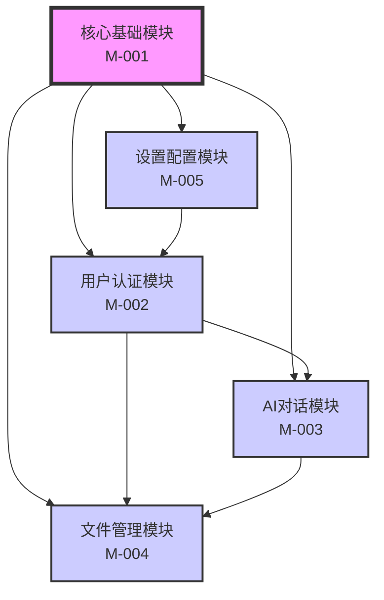

# 项目概览 - 模块化架构

## 项目信息

**项目名称**：`ai-frontend`
**项目描述**：AI项目的前端界面，基于React + Vite + TypeScript + Tailwind CSS技术栈
**架构版本**：`2.0.0` (模块化架构)
**最后更新**：`2026-03-20`

## 模块化架构设计

本项目采用**模块化功能文档系统**，将大型功能文档拆分为独立的模块文档，便于维护和团队协作。

### 文档层级结构
```
项目文档系统/
├── PROJECT-OVERVIEW.md          # 本文档：项目概览和模块关系
├── FEATURE-MAP.md              # 传统单文件模式（兼容性保留）
├── docs/modules/               # 模块化文档目录
│   ├── CORE-MODULE.md         # 核心基础模块
│   ├── AUTH-MODULE.md         # 用户认证模块
│   ├── CHAT-MODULE.md         # AI对话模块
│   ├── FILE-MODULE.md         # 文件管理模块
│   └── SETTINGS-MODULE.md     # 设置配置模块
└── scripts/module-manager.py  # 模块化文档管理工具
```

## 模块关系图



## 模块目录

### 核心模块

| 模块ID | 模块名称 | 状态 | 优先级 | 负责人 | 文档文件 |
|--------|----------|------|--------|--------|----------|
| `M-001` | `核心基础模块` | ✅ 已实现 | P0 | `系统` | `CORE-MODULE.md` |
| `M-002` | `用户认证模块` | 📋 规划中 | P1 | `待分配` | `AUTH-MODULE.md` |
| `M-003` | `AI对话模块` | 📋 规划中 | P0 | `待分配` | `CHAT-MODULE.md` |
| `M-004` | `文件管理模块` | 📋 规划中 | P2 | `待分配` | `FILE-MODULE.md` |
| `M-005` | `设置配置模块` | 📋 规划中 | P1 | `待分配` | `SETTINGS-MODULE.md` |

## 模块依赖矩阵

| 模块ID | M-001 | M-002 | M-003 | M-004 | M-005 |
|--------|-------|-------|-------|-------|-------|
| **M-001** | - | ✅ | ✅ | ✅ | ✅ |
| **M-002** | ❌ | - | ✅ | ✅ | 🔶 |
| **M-003** | ❌ | 🔶 | - | ✅ | 🔶 |
| **M-004** | ❌ | 🔶 | 🔶 | - | 🔶 |
| **M-005** | ❌ | ✅ | 🔶 | 🔶 | - |

**图例**：
- ✅：强依赖（必须存在）
- 🔶：弱依赖（可选依赖）
- ❌：无依赖

## 功能ID命名空间

为了保持全局唯一性，采用以下ID命名规范：

### 模块ID (Module ID)
- 格式：`M-XXX` (如 `M-001`, `M-002`)
- 范围：001-099 核心模块，100-199 业务模块

### 功能ID (Feature ID)
- 格式：`F-XXX` (如 `F-001`, `F-101`)
- 命名空间分配：
  - `F-001` 到 `F-099`：核心基础功能
  - `F-101` 到 `F-199`：用户认证功能
  - `F-201` 到 `F-299`：AI对话功能
  - `F-301` 到 `F-399`：文件管理功能
  - `F-401` 到 `F-499`：设置配置功能
  - `F-901` 到 `F-999`：跨模块功能

## 模块详细说明

### M-001: 核心基础模块
**描述**：项目基础框架和技术栈
**功能数量**：5个核心功能
**文档**：`docs/modules/CORE-MODULE.md`
**关键功能**：
- 项目基础框架 (F-001)
- 开发环境配置 (F-002)
- 构建系统 (F-003)
- 代码规范 (F-004)
- 测试框架 (F-005)

### M-002: 用户认证模块
**描述**：用户身份验证和权限管理
**功能数量**：8个规划功能
**文档**：`docs/modules/AUTH-MODULE.md`
**关键功能**：
- 用户登录 (F-101)
- 用户注册 (F-102)
- 权限管理 (F-103)
- 会话管理 (F-104)

### M-003: AI对话模块
**描述**：AI对话界面和交互逻辑
**功能数量**：12个规划功能
**文档**：`docs/modules/CHAT-MODULE.md`
**关键功能**：
- 消息历史 (F-201)
- 实时响应 (F-202)
- 多模型切换 (F-203)
- 对话管理 (F-204)

### M-004: 文件管理模块
**描述**：文件上传、预览和管理
**功能数量**：10个规划功能
**文档**：`docs/modules/FILE-MODULE.md`
**关键功能**：
- 文件上传 (F-301)
- 文件预览 (F-302)
- 批量处理 (F-303)
- 文件管理 (F-304)

### M-005: 设置配置模块
**描述**：用户设置和系统配置
**功能数量**：6个规划功能
**文档**：`docs/modules/SETTINGS-MODULE.md`
**关键功能**：
- 用户偏好设置 (F-401)
- 系统配置 (F-402)
- 主题切换 (F-403)
- 通知设置 (F-404)

## 工作流程

### 新增模块流程
1. 在本文档"模块目录"中添加新行
2. 创建模块文档 (`docs/modules/NEW-MODULE.md`)
3. 更新模块依赖矩阵
4. 更新模块关系图

### 新增功能流程（模块内）
1. 在对应模块文档中添加功能条目
2. 遵循功能ID命名空间规范
3. 更新模块内的功能依赖关系
4. 如涉及跨模块依赖，在本文档中更新模块依赖矩阵

### 模块间协作
1. **明确依赖**：在开始开发前，明确定义模块间依赖关系
2. **接口先行**：依赖其他模块时，先定义清晰的接口规范
3. **松耦合**：尽量减少模块间强依赖，使用事件或消息机制
4. **版本兼容**：模块升级时保持向后兼容性

## 工具支持

### 模块管理工具
```bash
# 列出所有模块
python scripts/module-manager.py list

# 查看模块详情
python scripts/module-manager.py show M-001

# 分析模块依赖
python scripts/module-manager.py deps M-001

# 验证模块完整性
python scripts/module-manager.py validate

# 聚合所有功能（生成传统FEATURE-MAP.md）
python scripts/module-manager.py aggregate
```

### 功能搜索
```bash
# 搜索跨模块功能
python scripts/module-manager.py search "用户登录"

# 查看功能依赖链
python scripts/module-manager.py feature-deps F-101
```

## 迁移指南

### 从单文件模式迁移
现有 `FEATURE-MAP.md` 中的功能已分配到各模块：
- `F-001` → `CORE-MODULE.md` (核心基础模块)
- `F-002` → `AUTH-MODULE.md` (用户认证模块)
- `F-003` → `CHAT-MODULE.md` (AI对话模块)
- `F-004` → `FILE-MODULE.md` (文件管理模块)
- `F-005` → `SETTINGS-MODULE.md` (设置配置模块)

### 向后兼容性
- 传统 `FEATURE-MAP.md` 文件保留，作为聚合视图
- 工具支持两种模式：单文件模式和模块化模式
- 可以随时使用 `aggregate` 命令生成完整的单文件视图

## 维护计划

### 定期审查
- **每周**：各模块负责人更新模块内功能状态
- **每月**：架构师审查模块依赖关系和接口定义
- **每季度**：整体架构评审，模块拆分/合并评估

### 文档同步
- 模块文档更新后，自动同步到聚合视图
- 关键变更需要在本文档中记录
- 保持模块间接口文档的一致性

## 附录

### 模块化优势
1. **可维护性**：单个文档不会过于庞大
2. **团队协作**：不同团队可以并行维护不同模块
3. **关注点分离**：各模块有清晰的职责边界
4. **可重用性**：模块可以在其他项目中复用
5. **渐进式演进**：可以逐步迁移到模块化架构

### 注意事项
1. **依赖管理**：注意避免循环依赖
2. **接口兼容**：模块升级时注意接口变化
3. **文档同步**：保持模块文档与代码实现同步
4. **工具支持**：使用工具确保文档一致性

---

*本文档定义了项目的模块化架构。所有新模块和功能都应遵循此架构规范。*