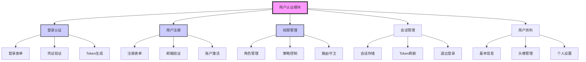

# 用户认证模块 (M-002)

## 模块概述

**模块名称**：`用户认证模块`
**模块ID**：`M-002`
**创建日期**：`2026-03-20`
**最后更新**：`2026-03-20`
**当前状态**：`📋 规划中`
**优先级**：`P1`
**负责人**：`待分配`

**模块描述**：
负责用户身份验证、权限管理和会话控制。提供安全的用户登录、注册、权限验证等功能，是所有需要用户身份的业务功能的基础。

**模块职责**：
1. 用户身份验证（登录/注册）
2. 权限控制和角色管理
3. 会话管理和状态保持
4. 用户个人信息管理
5. 安全认证和Token管理

## 模块架构



## 功能目录

| 功能ID | 功能名称 | 状态 | 优先级 | 负责人 | 最后更新 |
|--------|----------|------|--------|--------|----------|
| `F-101` | `用户登录` | 📋 规划中 | P1 | `待分配` | `2026-03-20` |
| `F-102` | `用户注册` | 📋 规划中 | P1 | `待分配` | `2026-03-20` |
| `F-103` | `权限管理` | 📋 规划中 | P1 | `待分配` | `2026-03-20` |
| `F-104` | `会话管理` | 📋 规划中 | P1 | `待分配` | `2026-03-20` |
| `F-105` | `用户资料管理` | 📋 规划中 | P2 | `待分配` | `2026-03-20` |
| `F-106` | `第三方登录` | 📋 规划中 | P2 | `待分配` | `2026-03-20` |
| `F-107` | `密码管理` | 📋 规划中 | P2 | `待分配` | `2026-03-20` |
| `F-108` | `安全审计` | 📋 规划中 | P3 | `待分配` | `2026-03-20` |

---

## 功能详情

### 功能ID: `F-101` - `用户登录`

#### 基本信息
- **功能名称**：`用户登录`
- **功能ID**：`F-101`
- **所属模块**：`M-002` (用户认证模块)
- **创建日期**：`2026-03-20`
- **最后更新**：`2026-03-20`
- **当前状态**：`📋 规划中`
- **优先级**：`P1`
- **负责人**：`待分配`

#### 功能描述
提供用户登录功能，验证用户凭证并建立用户会话。

**用户故事**：
> 作为 `用户`，我希望 `能够使用邮箱和密码登录系统`，以便 `访问我的个人数据和功能`。

**验收标准**：
- [ ] 提供登录表单界面
- [ ] 支持邮箱/密码验证
- [ ] 支持记住登录状态
- [ ] 登录成功后跳转到首页
- [ ] 登录失败显示友好错误信息
- [ ] 支持忘记密码功能

#### 依赖关系

**上游依赖**：
| 依赖项 | 类型 | 描述 | 状态 |
|--------|------|------|------|
| `M-001` | 模块依赖 | `核心基础模块提供React框架` | ✅ 就绪 |
| `后端API` | 服务依赖 | `提供用户认证API接口` | 📋 规划中 |

**下游依赖**：
| 依赖项 | 类型 | 描述 | 状态 |
|--------|------|------|------|
| `F-104` | 功能依赖 | `会话管理依赖登录功能` | 📋 规划中 |
| `所有需要认证的功能` | 功能依赖 | `都需要用户登录后才能访问` | 📋 规划中 |

#### 边界条件

**输入条件**：
- 输入类型：`邮箱地址、密码、记住我选项`
- 输入来源：`用户输入`
- 输入验证：
  - 邮箱格式验证
  - 密码长度验证（至少6位）
  - 必填字段验证
- 异常处理：`网络错误、服务器错误、凭证错误`

**输出条件**：
- 输出类型：`用户会话Token、用户基本信息`
- 输出目标：`前端状态管理、本地存储`
- 输出验证：`Token有效性验证、用户状态同步`

**限制条件**：
- 性能要求：`登录响应时间 < 2秒`
- 安全要求：`密码加密传输、防止暴力破解`
- 用户体验：`提供加载状态、错误提示`
- 兼容性：`支持主流浏览器`

#### 技术实现

**前端实现**：
```typescript
// 登录API调用
interface LoginRequest {
  email: string;
  password: string;
  rememberMe: boolean;
}

interface LoginResponse {
  token: string;
  user: UserInfo;
  expiresIn: number;
}

// 登录组件
function LoginForm() {
  const [formData, setFormData] = useState<LoginRequest>({
    email: '',
    password: '',
    rememberMe: false
  });
  
  const handleSubmit = async () => {
    try {
      const response = await authAPI.login(formData);
      // 保存Token和用户信息
      authStore.setToken(response.token);
      authStore.setUser(response.user);
      // 跳转到首页
      navigate('/dashboard');
    } catch (error) {
      showError('登录失败，请检查邮箱和密码');
    }
  };
  
  return (
    <form onSubmit={handleSubmit}>
      {/* 登录表单UI */}
    </form>
  );
}
```

**关键组件**：
| 组件名称 | 职责 | 技术栈 |
|----------|------|--------|
| `LoginForm` | `登录表单组件` | `React + TypeScript` |
| `AuthAPI` | `认证API服务` | `Axios + 拦截器` |
| `AuthStore` | `认证状态管理` | `Zustand/Redux` |
| `TokenManager` | `Token管理` | `LocalStorage + 内存缓存` |

**安全考虑**：
1. **密码加密**：前端使用HTTPS，后端存储加盐哈希
2. **防暴力破解**：登录失败次数限制
3. **Token安全**：使用HttpOnly Cookie或安全存储
4. **CSRF防护**：使用CSRF Token

---

### 功能ID: `F-102` - `用户注册`

#### 基本信息
- **功能名称**：`用户注册`
- **功能ID**：`F-102`
- **所属模块**：`M-002` (用户认证模块)
- **创建日期**：`2026-03-20`
- **最后更新**：`2026-03-20`
- **当前状态**：`📋 规划中`
- **优先级**：`P1`
- **负责人**：`待分配`

#### 功能描述
提供新用户注册功能，创建用户账户并发送验证邮件。

**用户故事**：
> 作为 `新用户`，我希望 `能够注册新账户`，以便 `使用系统的所有功能`。

**验收标准**：
- [ ] 提供注册表单界面
- [ ] 支持邮箱验证
- [ ] 密码强度检查
- [ ] 用户协议确认
- [ ] 注册成功提示和邮箱验证
- [ ] 支持注册后自动登录

#### 技术实现要点
1. **表单验证**：邮箱格式、密码强度、确认密码匹配
2. **验证码**：防止机器人注册
3. **邮箱验证**：发送验证链接或验证码
4. **用户体验**：注册进度提示、友好错误信息

---

### 功能ID: `F-103` - `权限管理`

#### 基本信息
- **功能名称**：`权限管理`
- **功能ID**：`F-103`
- **所属模块**：`M-002` (用户认证模块)
- **创建日期**：`2026-03-20`
- **最后更新**：`2026-03-20`
- **当前状态**：`📋 规划中`
- **优先级**：`P1`
- **负责人**：`待分配`

#### 功能描述
管理用户角色和权限，控制功能访问权限。

**功能要点**：
1. **角色系统**：管理员、普通用户、VIP用户等
2. **权限控制**：基于角色的访问控制（RBAC）
3. **路由守卫**：保护需要特定权限的路由
4. **组件权限**：根据权限显示/隐藏UI组件

---

## 模块内功能依赖矩阵

| 功能ID | F-101 | F-102 | F-103 | F-104 | F-105 | F-106 | F-107 | F-108 |
|--------|-------|-------|-------|-------|-------|-------|-------|-------|
| **F-101** | - | 🔶 | ✅ | ✅ | ✅ | 🔶 | ✅ | 🔶 |
| **F-102** | 🔶 | - | 🔶 | 🔶 | 🔶 | 🔶 | 🔶 | 🔶 |
| **F-103** | ❌ | ❌ | - | ✅ | 🔶 | ❌ | ❌ | ✅ |
| **F-104** | ✅ | 🔶 | 🔶 | - | ✅ | 🔶 | 🔶 | 🔶 |
| **F-105** | ❌ | ❌ | 🔶 | 🔶 | - | ❌ | 🔶 | 🔶 |
| **F-106** | 🔶 | 🔶 | 🔶 | 🔶 | 🔶 | - | 🔶 | 🔶 |
| **F-107** | ✅ | 🔶 | ❌ | 🔶 | 🔶 | 🔶 | - | 🔶 |
| **F-108** | 🔶 | 🔶 | ✅ | 🔶 | 🔶 | 🔶 | 🔶 | - |

**图例**：
- ✅：强依赖（必须存在）
- 🔶：弱依赖（可选依赖）
- ❌：无依赖

## 模块接口

### 对外暴露接口
1. **认证状态**：`useAuth()` Hook，提供用户登录状态
2. **登录接口**：`login(email, password)` 函数
3. **注册接口**：`register(userData)` 函数
4. **权限检查**：`hasPermission(permission)` 函数
5. **路由守卫**：`ProtectedRoute` 组件

### 依赖的其他模块
| 模块ID | 依赖类型 | 描述 |
|--------|----------|------|
| `M-001` | 强依赖 | `核心基础模块提供React框架和样式系统` |

### 被其他模块依赖
| 模块ID | 依赖类型 | 描述 |
|--------|----------|------|
| `M-003` | 强依赖 | `AI对话模块需要用户认证` |
| `M-004` | 强依赖 | `文件管理模块需要用户权限` |
| `M-005` | 强依赖 | `设置配置模块需要用户身份` |

## 数据模型

### 用户实体
```typescript
interface User {
  id: string;
  email: string;
  username: string;
  avatar?: string;
  roles: string[];
  permissions: string[];
  createdAt: Date;
  updatedAt: Date;
  lastLoginAt?: Date;
}
```

### 会话实体
```typescript
interface Session {
  token: string;
  userId: string;
  expiresAt: Date;
  deviceInfo: string;
  createdAt: Date;
}
```

### 权限实体
```typescript
interface Permission {
  id: string;
  name: string;
  description: string;
  resource: string;
  action: 'read' | 'write' | 'delete' | 'admin';
}
```

## API设计

### 认证API
```typescript
// 登录
POST /api/auth/login
Body: { email, password, rememberMe }

// 注册
POST /api/auth/register
Body: { email, password, username, agreeToTerms }

// 登出
POST /api/auth/logout

// 刷新Token
POST /api/auth/refresh-token

// 获取当前用户
GET /api/auth/me
```

### 权限API
```typescript
// 获取用户权限
GET /api/auth/permissions

// 检查权限
POST /api/auth/check-permission
Body: { permission: string }
```

## 安全考虑

### 认证安全
1. **密码安全**：前端HTTPS传输，后端加盐哈希存储
2. **会话安全**：使用JWT Token，设置合理过期时间
3. **防CSRF**：使用CSRF Token保护重要操作
4. **防暴力破解**：登录失败次数限制和延迟

### 权限安全
1. **最小权限原则**：默认只赋予必要权限
2. **前端验证**：UI层面的权限控制
3. **后端验证**：所有API请求必须验证权限
4. **审计日志**：记录敏感操作日志

## 维护指南

### 开发顺序
1. **第一阶段**：实现F-101用户登录和F-104会话管理
2. **第二阶段**：实现F-102用户注册和F-107密码管理
3. **第三阶段**：实现F-103权限管理和F-105用户资料
4. **第四阶段**：实现F-106第三方登录和F-108安全审计

### 测试策略
1. **单元测试**：测试认证逻辑和工具函数
2. **集成测试**：测试API调用和状态管理
3. **E2E测试**：测试完整的用户登录流程
4. **安全测试**：测试认证安全漏洞

### 性能优化
1. **Token缓存**：合理缓存Token减少API调用
2. **权限缓存**：缓存用户权限信息
3. **懒加载**：按需加载认证相关组件
4. **错误处理**：优雅的错误处理和重试机制

## 附录

### 技术选型
| 技术 | 选择 | 说明 |
|------|------|------|
| 状态管理 | `Zustand` | 轻量级状态管理，适合认证状态 |
| HTTP客户端 | `Axios` | 支持拦截器，适合Token管理 |
| 表单处理 | `React Hook Form` | 高性能表单库 |
| 路由守卫 | `React Router` | 集成路由权限控制 |

### 参考标准
- OAuth 2.0 / OpenID Connect
- JWT (JSON Web Tokens)
- RFC 6749 (OAuth 2.0)
- Web安全最佳实践

---

*本文档是用户认证模块的功能文档。所有认证相关功能的变更都应在此文档中记录。*