# AI对话模块 (M-003)

## 模块概述

**模块名称**：`AI对话模块`
**模块ID**：`M-003`
**创建日期**：`2026-03-20`
**最后更新**：`2026-03-20`
**当前状态**：`📋 规划中`
**优先级**：`P0`
**负责人**：`待分配`

**模块描述**：
提供AI对话界面和交互功能，支持多模型对话、消息历史管理、实时响应等核心AI交互能力。是项目的核心业务模块。

**模块职责**：
1. AI对话界面展示和交互
2. 多模型支持和切换
3. 消息历史管理和持久化
4. 实时响应和流式输出
5. 对话上下文管理
6. 文件上传和内容分析

## 模块架构

```mermaid
graph TD
    CHAT[AI对话模块] --> INTERFACE[对话界面]
    CHAT --> MESSAGES[消息管理]
    CHAT --> MODELS[模型管理]
    CHAT --> STREAMING[流式响应]
    CHAT --> CONTEXT[上下文管理]
    
    INTERFACE --> LAYOUT[界面布局]
    INTERFACE --> INPUT[输入区域]
    INTERFACE --> OUTPUT[输出区域]
    INTERFACE --> CONTROLS[控制面板]
    
    MESSAGES --> HISTORY[历史记录]
    MESSAGES --> PERSISTENCE[消息持久化]
    MESSAGES --> SEARCH[消息搜索]
    MESSAGES --> IMPORT[消息导入导出]
    
    MODELS --> SELECTION[模型选择]
    MODELS --> CONFIG[模型配置]
    MODELS --> SWITCHING[模型切换]
    MODELS --> COMPARISON[模型对比]
    
    STREAMING --> REAL_TIME[实时显示]
    STREAMING --> PROGRESS[进度指示]
    STREAMING --> CANCEL[取消响应]
    STREAMING --> ERROR[错误处理]
    
    CONTEXT --> MANAGEMENT[上下文管理]
    CONTEXT --> COMPRESSION[上下文压缩]
    CONTEXT --> SUMMARY[对话摘要]
    CONTEXT --> EXPORT[上下文导出]
    
    style CHAT fill:#f9f,stroke:#333,stroke-width:4px
    style INTERFACE fill:#ccf,stroke:#333,stroke-width:2px
    style MESSAGES fill:#ccf,stroke:#333,stroke-width:2px
```



## 功能目录

| 功能ID | 功能名称 | 状态 | 优先级 | 负责人 | 最后更新 |
|--------|----------|------|--------|--------|----------|
| `F-201` | `对话界面布局` | 📋 规划中 | P0 | `待分配` | `2026-03-20` |
| `F-202` | `消息输入发送` | 📋 规划中 | P0 | `待分配` | `2026-03-20` |
| `F-203` | `实时消息显示` | 📋 规划中 | P0 | `待分配` | `2026-03-20` |
| `F-204` | `对话历史管理` | 📋 规划中 | P1 | `待分配` | `2026-03-20` |
| `F-205` | `多模型切换` | 📋 规划中 | P1 | `待分配` | `2026-03-20` |
| `F-206` | `上下文管理` | 📋 规划中 | P1 | `待分配` | `2026-03-20` |
| `F-207` | `对话设置` | 📋 规划中 | P2 | `待分配` | `2026-03-20` |
| `F-208` | `文件对话支持` | 📋 规划中 | P2 | `待分配` | `2026-03-20` |
| `F-209` | `代码高亮显示` | 📋 规划中 | P2 | `待分配` | `2026-03-20` |
| `F-210` | `对话分享` | 📋 规划中 | P3 | `待分配` | `2026-03-20` |

---

## 功能详情

### 功能ID: `F-201` - `对话界面布局`

#### 基本信息
- **功能名称**：`对话界面布局`
- **功能ID**：`F-201`
- **所属模块**：`M-003` (AI对话模块)
- **创建日期**：`2026-03-20`
- **最后更新**：`2026-03-20`
- **当前状态**：`📋 规划中`
- **优先级**：`P0`
- **负责人**：`待分配`

#### 功能描述
设计并实现AI对话的主界面布局，提供良好的用户体验和交互设计。

**用户故事**：
> 作为 `用户`，我希望 `有一个清晰直观的对话界面`，以便 `方便地与AI进行对话交互`。

**验收标准**：
- [ ] 清晰的对话区域布局
- [ ] 消息列表显示区域
- [ ] 输入框和发送按钮
- [ ] 模型选择和设置面板
- [ ] 响应式设计，适配不同屏幕尺寸
- [ ] 加载状态和错误提示区域

#### 依赖关系

**上游依赖**：
| 依赖项 | 类型 | 描述 | 状态 |
|--------|------|------|------|
| `M-001` | 模块依赖 | `核心基础模块提供React框架和样式` | ✅ 就绪 |
| `M-002` | 模块依赖 | `用户认证模块提供用户身份` | 📋 规划中 |

**下游依赖**：
| 依赖项 | 类型 | 描述 | 状态 |
|--------|------|------|------|
| `F-202` | 功能依赖 | `消息输入发送需要界面布局` | 📋 规划中 |
| `F-203` | 功能依赖 | `实时消息显示需要界面容器` | 📋 规划中 |

#### 界面设计

**布局结构**：
```typescript
// 主布局组件结构
<ChatLayout>
  <ChatHeader>      // 头部：标题、模型选择、设置
  <ChatSidebar>     // 侧边栏：对话历史、搜索
  <ChatMain>        // 主区域：消息列表
    <MessageList>   // 消息列表
      <MessageItem> // 单条消息
    </MessageList>
  </ChatMain>
  <ChatInput>       // 输入区域：输入框、发送按钮、附件
</ChatLayout>
```

**响应式设计**：
- **桌面端**：三栏布局（侧边栏-主区域-设置面板）
- **平板端**：双栏布局（可折叠侧边栏）
- **移动端**：单栏布局，全屏对话体验

**组件设计**：
| 组件名称 | 职责 | 技术实现 |
|----------|------|----------|
| `ChatLayout` | `对话主布局` | `Flexbox/Grid布局` |
| `MessageList` | `消息列表容器` | `虚拟滚动优化` |
| `MessageItem` | `单条消息显示` | `条件渲染不同消息类型` |
| `ChatInput` | `消息输入区域` | `富文本输入支持` |

---

### 功能ID: `F-202` - `消息输入发送`

#### 基本信息
- **功能名称**：`消息输入发送`
- **功能ID**：`F-202`
- **所属模块**：`M-003` (AI对话模块)
- **创建日期**：`2026-03-20`
- **最后更新**：`2026-03-20`
- **当前状态**：`📋 规划中`
- **优先级**：`P0`
- **负责人**：`待分配`

#### 功能描述
提供消息输入、编辑和发送功能，支持文本、文件等多种输入方式。

**功能要点**：
1. **文本输入**：支持Markdown、表情符号、@提及
2. **文件附件**：支持图片、文档、代码文件上传
3. **快捷操作**：快捷键支持、命令补全
4. **输入验证**：内容长度、类型验证
5. **发送控制**：防重复发送、发送状态反馈

#### 技术实现
```typescript
// 输入组件
function ChatInput() {
  const [message, setMessage] = useState('');
  const [files, setFiles] = useState<File[]>([]);
  const [isSending, setIsSending] = useState(false);
  
  const handleSend = async () => {
    if (!message.trim() && files.length === 0) return;
    
    setIsSending(true);
    try {
      await chatAPI.sendMessage({
        content: message,
        files: files,
        model: selectedModel,
        context: currentContext
      });
      setMessage('');
      setFiles([]);
    } catch (error) {
      showError('发送失败，请重试');
    } finally {
      setIsSending(false);
    }
  };
  
  const handleKeyDown = (e: React.KeyboardEvent) => {
    if (e.key === 'Enter' && !e.shiftKey) {
      e.preventDefault();
      handleSend();
    }
  };
  
  return (
    <div className="chat-input">
      <textarea
        value={message}
        onChange={(e) => setMessage(e.target.value)}
        onKeyDown={handleKeyDown}
        placeholder="输入消息..."
        disabled={isSending}
      />
      <FileUpload onFilesSelect={setFiles} />
      <button onClick={handleSend} disabled={isSending}>
        {isSending ? '发送中...' : '发送'}
      </button>
    </div>
  );
}
```

---

### 功能ID: `F-203` - `实时消息显示`

#### 基本信息
- **功能名称**：`实时消息显示`
- **功能ID**：`F-203`
- **所属模块**：`M-003` (AI对话模块)
- **创建日期**：`2026-03-20`
- **最后更新**：`2026-03-20`
- **当前状态**：`📋 规划中`
- **优先级**：`P0`
- **负责人**：`待分配`

#### 功能描述
实时显示AI响应消息，支持流式输出、代码高亮、Markdown渲染等。

**功能要点**：
1. **流式显示**：实时显示AI生成的文本
2. **格式渲染**：Markdown、代码高亮、LaTeX
3. **交互功能**：复制代码、展开/收起长内容
4. **性能优化**：虚拟滚动、懒加载图片
5. **错误处理**：显示错误信息、重试选项

#### 流式显示实现
```typescript
// 流式消息显示组件
function StreamingMessage({ stream }: { stream: ReadableStream }) {
  const [content, setContent] = useState('');
  const [isComplete, setIsComplete] = useState(false);
  
  useEffect(() => {
    const reader = stream.getReader();
    const decoder = new TextDecoder();
    
    const readStream = async () => {
      try {
        while (true) {
          const { done, value } = await reader.read();
          if (done) {
            setIsComplete(true);
            break;
          }
          
          const text = decoder.decode(value);
          setContent(prev => prev + text);
        }
      } catch (error) {
        console.error('流读取错误:', error);
      } finally {
        reader.releaseLock();
      }
    };
    
    readStream();
    
    return () => {
      reader.cancel();
    };
  }, [stream]);
  
  return (
    <div className="streaming-message">
      <MarkdownRenderer content={content} />
      {!isComplete && <LoadingIndicator />}
    </div>
  );
}
```

---

## 模块内功能依赖矩阵

| 功能ID | F-201 | F-202 | F-203 | F-204 | F-205 | F-206 | F-207 | F-208 | F-209 | F-210 |
|--------|-------|-------|-------|-------|-------|-------|-------|-------|-------|-------|
| **F-201** | - | ✅ | ✅ | 🔶 | 🔶 | 🔶 | 🔶 | 🔶 | 🔶 | 🔶 |
| **F-202** | ✅ | - | ✅ | 🔶 | 🔶 | 🔶 | 🔶 | ✅ | 🔶 | 🔶 |
| **F-203** | ✅ | ✅ | - | 🔶 | 🔶 | 🔶 | 🔶 | 🔶 | ✅ | 🔶 |
| **F-204** | 🔶 | 🔶 | 🔶 | - | 🔶 | ✅ | 🔶 | 🔶 | 🔶 | ✅ |
| **F-205** | 🔶 | 🔶 | 🔶 | 🔶 | - | 🔶 | ✅ | 🔶 | 🔶 | 🔶 |
| **F-206** | 🔶 | 🔶 | 🔶 | ✅ | 🔶 | - | 🔶 | 🔶 | 🔶 | 🔶 |
| **F-207** | 🔶 | 🔶 | 🔶 | 🔶 | ✅ | 🔶 | - | 🔶 | 🔶 | 🔶 |
| **F-208** | 🔶 | ✅ | 🔶 | 🔶 | 🔶 | 🔶 | 🔶 | - | 🔶 | 🔶 |
| **F-209** | 🔶 | 🔶 | ✅ | 🔶 | 🔶 | 🔶 | 🔶 | 🔶 | - | 🔶 |
| **F-210** | 🔶 | 🔶 | 🔶 | ✅ | 🔶 | 🔶 | 🔶 | 🔶 | 🔶 | - |

**图例**：
- ✅：强依赖（必须存在）
- 🔶：弱依赖（可选依赖）
- ❌：无依赖

## 模块接口

### 对外暴露接口
1. **对话组件**：`ChatInterface` 主对话组件
2. **消息管理**：`useChat()` Hook，提供消息操作
3. **模型管理**：`useModel()` Hook，管理模型配置
4. **上下文管理**：`useContext()` Hook，管理对话上下文

### 依赖的其他模块
| 模块ID | 依赖类型 | 描述 |
|--------|----------|------|
| `M-001` | 强依赖 | `核心基础模块` |
| `M-002` | 强依赖 | `用户认证模块` |
| `M-004` | 弱依赖 | `文件管理模块（文件上传）` |

### 被其他模块依赖
| 模块ID | 依赖类型 | 描述 |
|--------|----------|------|
| `无` | - | `当前是核心业务模块` |

## 数据模型

### 消息实体
```typescript
interface Message {
  id: string;
  role: 'user' | 'assistant' | 'system';
  content: string;
  model?: string;           // 使用的模型
  contextId?: string;       // 所属上下文
  files?: FileAttachment[]; // 附件文件
  metadata?: {
    tokens?: number;        // token消耗
    latency?: number;       // 响应延迟
    finishReason?: string;  // 完成原因
  };
  createdAt: Date;
  updatedAt: Date;
}
```

### 对话上下文
```typescript
interface ConversationContext {
  id: string;
  title: string;
  model: string;
  messages: Message[];
  settings: ConversationSettings;
  summary?: string;         // 对话摘要
  tags: string[];           // 标签
  isArchived: boolean;
  createdAt: Date;
  updatedAt: Date;
}
```

### 模型配置
```typescript
interface ModelConfig {
  id: string;
  name: string;
  provider: 'openai' | 'anthropic' | 'deepseek' | 'custom';
  capabilities: string[];   // 支持的能力
  maxTokens: number;
  supportsStreaming: boolean;
  supportsVision: boolean;
  defaultParams: ModelParams;
}
```

## API设计

### 对话API
```typescript
// 发送消息（流式）
POST /api/chat/messages/stream
Body: { content, model, contextId, files }
Response: Stream

// 发送消息（非流式）
POST /api/chat/messages
Body: { content, model, contextId, files }

// 获取对话历史
GET /api/chat/conversations

// 获取单条对话详情
GET /api/chat/conversations/:id

// 删除对话
DELETE /api/chat/conversations/:id
```

### 模型API
```typescript
// 获取可用模型
GET /api/chat/models

// 切换模型
POST /api/chat/models/switch
Body: { modelId }
```

## 性能优化

### 消息列表优化
1. **虚拟滚动**：大量消息时只渲染可见区域
2. **懒加载**：图片、文件等资源按需加载
3. **分页加载**：历史消息分页加载
4. **缓存策略**：常用对话缓存到本地

### 流式响应优化
1. **增量更新**：避免频繁重渲染
2. **防抖处理**：控制更新频率
3. **内存管理**：及时清理已完成的流
4. **错误恢复**：网络中断后恢复连接

## 用户体验

### 交互设计
1. **键盘快捷键**：快速发送、导航、操作
2. **拖拽上传**：支持文件拖拽上传
3. **上下文菜单**：消息右键菜单
4. **撤销重做**：支持消息操作撤销

### 无障碍设计
1. **屏幕阅读器**：支持屏幕阅读器
2. **键盘导航**：完整的键盘导航支持
3. **高对比度**：高对比度模式支持
4. **文字缩放**：适应系统文字大小

## 测试策略

### 测试类型
1. **单元测试**：测试消息处理、格式转换等工具函数
2. **组件测试**：测试UI组件交互和状态
3. **集成测试**：测试API调用和状态管理
4. **E2E测试**：测试完整的对话流程
5. **性能测试**：测试大量消息时的性能

### 测试工具
- **Jest**：单元测试和组件测试
- **Testing Library**：React组件测试
- **Cypress**：E2E测试
- **Lighthouse**：性能测试

## 维护指南

### 开发优先级
1. **MVP阶段**：F-201, F-202, F-203（基本对话功能）
2. **增强阶段**：F-204, F-205, F-206（历史、模型、上下文）
3. **完善阶段**：F-207, F-208, F-209（设置、文件、代码高亮）
4. **扩展阶段**：F-210（分享功能）和其他扩展功能

### 技术债务管理
1. **定期重构**：每季度评估和重构关键组件
2. **依赖更新**：定期更新第三方库
3. **性能监控**：监控关键性能指标
4. **代码审查**：严格执行代码审查流程

## 附录

### 技术选型
| 技术 | 选择 | 说明 |
|------|------|------|
| 状态管理 | `Zustand` | 轻量级，适合对话状态 |
| 流式处理 | `ReadableStream` | 原生流API，性能好 |
| Markdown渲染 | `react-markdown` | 功能丰富，支持插件 |
| 代码高亮 | `prismjs` | 支持多种语言，主题丰富 |
| 虚拟滚动 | `react-window` | 高性能虚拟列表 |

### 设计资源
- Figma设计稿链接
- 设计系统文档
- 交互原型
- 用户测试报告

---

*本文档是AI对话模块的功能文档。所有对话相关功能的变更都应在此文档中记录。*