# 设置配置模块 (M-005)

## 模块概述

**模块名称**：`设置配置模块`
**模块ID**：`M-005`
**创建日期**：`2026-03-20`
**最后更新**：`2026-03-20`
**当前状态**：`📋 规划中`
**优先级**：`P1`
**负责人**：`待分配`

**模块描述**：
负责用户偏好设置、系统配置和应用个性化功能。提供统一的设置管理界面，支持用户自定义应用行为、外观和功能。

**模块职责**：
1. 用户偏好设置管理
2. 应用主题和外观配置
3. 通知和提醒设置
4. 隐私和安全设置
5. 数据管理和导出
6. 系统级配置管理

## 模块架构

```mermaid
graph TD
    SETTINGS[设置配置模块] --> PREFERENCES[用户偏好]
    SETTINGS --> APPEARANCE[外观主题]
    SETTINGS --> NOTIFICATIONS[通知设置]
    SETTINGS --> PRIVACY[隐私安全]
    SETTINGS --> DATA[数据管理]
    SETTINGS --> SYSTEM[系统配置]
    
    PREFERENCES --> GENERAL[通用设置]
    PREFERENCES --> LANGUAGE[语言时区]
    PREFERENCES --> ACCESSIBILITY[无障碍]
    PREFERENCES --> SHORTCUTS[快捷键]
    
    APPEARANCE --> THEME[主题切换]
    APPEARANCE --> LAYOUT[界面布局]
    APPEARANCE --> FONT[字体设置]
    APPEARANCE --> COLOR[颜色方案]
    
    NOTIFICATIONS --> TYPES[通知类型]
    NOTIFICATIONS --> SCHEDULE[通知计划]
    NOTIFICATIONS --> CHANNELS[通知渠道]
    NOTIFICATIONS --> SOUNDS[声音提醒]
    
    PRIVACY --> PERMISSIONS[权限管理]
    PRIVACY --> DATA_CONTROL[数据控制]
    PRIVACY --> SECURITY[安全设置]
    PRIVACY --> CLEAR_DATA[数据清理]
    
    DATA --> EXPORT[数据导出]
    DATA --> IMPORT[数据导入]
    DATA --> BACKUP[备份恢复]
    DATA --> SYNC[数据同步]
    
    SYSTEM --> PERFORMANCE[性能设置]
    SYSTEM --> NETWORK[网络配置]
    SYSTEM --> STORAGE[存储管理]
    SYSTEM --> UPDATES[更新设置]
    
    style SETTINGS fill:#f9f,stroke:#333,stroke-width:4px
    style PREFERENCES fill:#ccf,stroke:#333,stroke-width:2px
    style APPEARANCE fill:#ccf,stroke:#333,stroke-width:2px
    style NOTIFICATIONS fill:#ccf,stroke:#333,stroke-width:2px
```



## 功能目录

| 功能ID | 功能名称 | 状态 | 优先级 | 负责人 | 最后更新 |
|--------|----------|------|--------|--------|----------|
| `F-401` | `用户偏好设置` | 📋 规划中 | P1 | `待分配` | `2026-03-20` |
| `F-402` | `主题切换` | 📋 规划中 | P1 | `待分配` | `2026-03-20` |
| `F-403` | `通知设置` | 📋 规划中 | P2 | `待分配` | `2026-03-20` |
| `F-404` | `隐私设置` | 📋 规划中 | P1 | `待分配` | `2026-03-20` |
| `F-405` | `数据管理` | 📋 规划中 | P2 | `待分配` | `2026-03-20` |
| `F-406` | `系统配置` | 📋 规划中 | P3 | `待分配` | `2026-03-20` |
| `F-407` | `设置导入导出` | 📋 规划中 | P3 | `待分配` | `2026-03-20` |
| `F-408` | `设置同步` | 📋 规划中 | P3 | `待分配` | `2026-03-20` |

---

## 功能详情

### 功能ID: `F-401` - `用户偏好设置`

#### 基本信息
- **功能名称**：`用户偏好设置`
- **功能ID**：`F-401`
- **所属模块**：`M-005` (设置配置模块)
- **创建日期**：`2026-03-20`
- **最后更新**：`2026-03-20`
- **当前状态**：`📋 规划中`
- **优先级**：`P1`
- **负责人**：`待分配`

#### 功能描述
管理用户的个性化偏好设置，包括语言、时区、界面行为等。

**用户故事**：
> 作为 `用户`，我希望 `能够自定义应用的各项设置`，以便 `获得更好的使用体验`。

**验收标准**：
- [ ] 提供统一的设置管理界面
- [ ] 支持语言和时区设置
- [ ] 配置界面行为偏好
- [ ] 设置自动保存和恢复
- [ ] 支持重置为默认设置
- [ ] 设置分组和搜索功能

#### 依赖关系

**上游依赖**：
| 依赖项 | 类型 | 描述 | 状态 |
|--------|------|------|------|
| `M-001` | 模块依赖 | `核心基础模块` | ✅ 就绪 |
| `M-002` | 模块依赖 | `用户认证模块` | 📋 规划中 |

**下游依赖**：
| 依赖项 | 类型 | 描述 | 状态 |
|--------|------|------|------|
| `所有其他设置功能` | 功能依赖 | `其他设置功能的容器` | 📋 规划中 |

#### 设置分类

**通用设置**：
1. **语言**：应用界面语言选择
2. **时区**：时间显示时区设置
3. **日期格式**：日期显示格式
4. **数字格式**：数字和货币格式

**界面行为**：
1. **动画效果**：界面动画开关
2. **确认对话框**：操作确认设置
3. **自动保存**：自动保存间隔
4. **页面加载**：页面加载行为

**无障碍设置**：
1. **字体大小**：界面字体缩放
2. **对比度**：高对比度模式
3. **屏幕阅读器**：屏幕阅读器优化
4. **键盘导航**：键盘快捷键设置

#### 技术实现

**设置存储结构**：
```typescript
interface UserPreferences {
  // 通用设置
  language: string;
  timezone: string;
  dateFormat: 'YYYY-MM-DD' | 'MM/DD/YYYY' | 'DD/MM/YYYY';
  numberFormat: {
    decimalSeparator: '.' | ',';
    thousandSeparator: ',' | '.' | ' ';
  };
  
  // 界面行为
  ui: {
    animations: boolean;
    confirmDialogs: boolean;
    autoSave: boolean;
    autoSaveInterval: number; // 分钟
    pageLoadStrategy: 'eager' | 'lazy';
  };
  
  // 无障碍
  accessibility: {
    fontSize: 'small' | 'normal' | 'large' | 'x-large';
    highContrast: boolean;
    reducedMotion: boolean;
    screenReaderOptimized: boolean;
  };
  
  // 其他模块的设置会在各自模块中定义
  [key: string]: any;
}
```

**设置管理组件**：
```typescript
function PreferencesSettings() {
  const [preferences, setPreferences] = usePreferences();
  const [saving, setSaving] = useState(false);
  
  const handleChange = async (path: string, value: any) => {
    const newPrefs = setIn(preferences, path, value);
    setPreferences(newPrefs);
    
    // 自动保存到服务器
    setSaving(true);
    try {
      await savePreferences(newPrefs);
    } catch (error) {
      console.error('保存设置失败:', error);
      // 可以显示错误提示，但不要回滚本地更改
    } finally {
      setSaving(false);
    }
  };
  
  return (
    <div className="preferences-settings">
      <div className="settings-header">
        <h2>用户偏好设置</h2>
        {saving && <span className="saving-indicator">保存中...</span>}
      </div>
      
      <SettingsTabs>
        <SettingsTab title="通用">
          <LanguageSelector
            value={preferences.language}
            onChange={(lang) => handleChange('language', lang)}
          />
          <TimezoneSelector
            value={preferences.timezone}
            onChange={(tz) => handleChange('timezone', tz)}
          />
        </SettingsTab>
        
        <SettingsTab title="界面行为">
          <ToggleSetting
            label="启用动画效果"
            value={preferences.ui.animations}
            onChange={(val) => handleChange('ui.animations', val)}
          />
          <NumberSetting
            label="自动保存间隔（分钟）"
            value={preferences.ui.autoSaveInterval}
            min={1}
            max={60}
            onChange={(val) => handleChange('ui.autoSaveInterval', val)}
          />
        </SettingsTab>
        
        <SettingsTab title="无障碍">
          <SelectSetting
            label="字体大小"
            value={preferences.accessibility.fontSize}
            options={[
              { value: 'small', label: '小' },
              { value: 'normal', label: '正常' },
              { value: 'large', label: '大' },
              { value: 'x-large', label: '特大' }
            ]}
            onChange={(val) => handleChange('accessibility.fontSize', val)}
          />
          <ToggleSetting
            label="高对比度模式"
            value={preferences.accessibility.highContrast}
            onChange={(val) => handleChange('accessibility.highContrast', val)}
          />
        </SettingsTab>
      </SettingsTabs>
      
      <div className="settings-footer">
        <button onClick={() => resetToDefaults()}>
          恢复默认设置
        </button>
      </div>
    </div>
  );
}
```

**设置持久化**：
```typescript
// 设置存储Hook
function usePreferences() {
  const [preferences, setPreferencesState] = useState<UserPreferences>(() => {
    // 从本地存储加载
    const saved = localStorage.getItem('user-preferences');
    if (saved) {
      return { ...defaultPreferences, ...JSON.parse(saved) };
    }
    return defaultPreferences;
  });
  
  const setPreferences = useCallback((newPrefs: UserPreferences) => {
    setPreferencesState(newPrefs);
    
    // 保存到本地存储
    localStorage.setItem('user-preferences', JSON.stringify(newPrefs));
    
    // 应用设置变更（如语言、主题等）
    applyPreferences(newPrefs);
  }, []);
  
  return [preferences, setPreferences] as const;
}
```

---

### 功能ID: `F-402` - `主题切换`

#### 基本信息
- **功能名称**：`主题切换`
- **功能ID**：`F-402`
- **所属模块**：`M-005` (设置配置模块)
- **创建日期**：`2026-03-20`
- **最后更新**：`2026-03-20`
- **当前状态**：`📋 规划中`
- **优先级**：`P1`
- **负责人**：`待分配`

#### 功能描述
提供应用主题切换功能，支持亮色/暗色模式以及自定义主题。

**功能要点**：
1. **主题系统**：支持亮色、暗色、自动模式
2. **自定义主题**：允许用户自定义颜色方案
3. **主题预览**：实时预览主题效果
4. **系统同步**：与操作系统主题同步
5. **主题市场**：可选的主题包下载

#### 主题配置
```typescript
interface ThemeConfig {
  id: string;
  name: string;
  type: 'light' | 'dark' | 'custom';
  colors: {
    primary: string;
    secondary: string;
    background: string;
    surface: string;
    text: string;
    textSecondary: string;
    border: string;
    success: string;
    warning: string;
    error: string;
    info: string;
  };
  typography: {
    fontFamily: string;
    fontSize: number;
    lineHeight: number;
  };
  spacing: {
    unit: number;
  };
  borderRadius: {
    small: number;
    medium: number;
    large: number;
  };
}
```

---

### 功能ID: `F-403` - `通知设置`

#### 基本信息
- **功能名称**：`通知设置`
- **功能ID**：`F-403`
- **所属模块**：`M-005` (设置配置模块)
- **创建日期**：`2026-03-20`
- **最后更新**：`2026-03-20`
- **当前状态**：`📋 规划中`
- **优先级**：`P2`
- **负责人**：`待分配`

#### 功能描述
管理应用通知和提醒设置，包括通知类型、渠道和计划。

**功能要点**：
1. **通知类型**：对话消息、系统通知、更新提醒等
2. **通知渠道**：应用内、邮件、推送通知
3. **免打扰**：设置免打扰时间段
4. **声音设置**：自定义通知声音
5. **权限管理**：通知权限请求和管理

---

## 模块内功能依赖矩阵

| 功能ID | F-401 | F-402 | F-403 | F-404 | F-405 | F-406 | F-407 | F-408 |
|--------|-------|-------|-------|-------|-------|-------|-------|-------|
| **F-401** | - | 🔶 | 🔶 | 🔶 | 🔶 | 🔶 | 🔶 | 🔶 |
| **F-402** | 🔶 | - | ❌ | ❌ | ❌ | ❌ | ❌ | ❌ |
| **F-403** | 🔶 | ❌ | - | ✅ | 🔶 | 🔶 | 🔶 | 🔶 |
| **F-404** | 🔶 | ❌ | ✅ | - | ✅ | 🔶 | 🔶 | 🔶 |
| **F-405** | 🔶 | ❌ | 🔶 | ✅ | - | 🔶 | ✅ | ✅ |
| **F-406** | 🔶 | ❌ | 🔶 | 🔶 | 🔶 | - | 🔶 | 🔶 |
| **F-407** | 🔶 | ❌ | 🔶 | 🔶 | ✅ | 🔶 | - | ✅ |
| **F-408** | 🔶 | ❌ | 🔶 | 🔶 | ✅ | 🔶 | ✅ | - |

**图例**：
- ✅：强依赖（必须存在）
- 🔶：弱依赖（可选依赖）
- ❌：无依赖

## 模块接口

### 对外暴露接口
1. **设置管理**：`useSettings()` Hook，统一设置管理
2. **主题切换**：`ThemeProvider` 和 `useTheme()` Hook
3. **通知设置**：`NotificationSettings` 组件
4. **设置同步**：`SettingsSync` 服务和组件

### 依赖的其他模块
| 模块ID | 依赖类型 | 描述 |
|--------|----------|------|
| `M-001` | 强依赖 | `核心基础模块` |
| `M-002` | 强依赖 | `用户认证模块（用户设置关联）` |
| `M-003` | 弱依赖 | `AI对话模块（对话相关设置）` |
| `M-004` | 弱依赖 | `文件管理模块（文件相关设置）` |

### 被其他模块依赖
| 模块ID | 依赖类型 | 描述 |
|--------|----------|------|
| `所有模块` | 弱依赖 | `所有模块都可以使用设置系统` |
| `M-002` | 强依赖 | `用户认证模块需要主题和语言设置` |

## 数据模型

### 用户设置
```typescript
interface UserSettings {
  userId: string;
  preferences: UserPreferences;
  theme: ThemeConfig;
  notifications: NotificationSettings;
  privacy: PrivacySettings;
  data: DataSettings;
  system: SystemSettings;
  version: number;
  lastModified: Date;
  syncStatus: 'synced' | 'pending' | 'conflict';
}
```

### 主题配置
```typescript
interface ThemeSettings {
  currentTheme: string;
  autoSwitch: boolean;      // 自动切换亮色/暗色
  followSystem: boolean;    // 跟随系统主题
  customThemes: CustomTheme[];
  lastThemeChange: Date;
}
```

### 通知设置
```typescript
interface NotificationSettings {
  enabled: boolean;
  types: {
    messages: boolean;      // 新消息通知
    mentions: boolean;      // @提及通知
    system: boolean;        // 系统通知
    updates: boolean;       // 更新通知
  };
  channels: {
    inApp: boolean;         // 应用内通知
    email: boolean;         // 邮件通知
    push: boolean;          // 推送通知
  };
  quietHours: {
    enabled: boolean;
    startTime: string;      // "22:00"
    endTime: string;        // "08:00"
    days: number[];         // [0,1,2,3,4,5,6] 周日到周六
  };
  sounds: {
    enabled: boolean;
    volume: number;         // 0-100
    customSound?: string;   // 自定义声音文件
  };
}
```

## API设计

### 设置API
```typescript
// 获取用户设置
GET /api/settings
Response: UserSettings

// 更新设置
PUT /api/settings
Body: Partial<UserSettings>

// 重置为默认设置
POST /api/settings/reset

// 导出设置
GET /api/settings/export
Response: JSON文件

// 导入设置
POST /api/settings/import
Body: { settings: UserSettings }
```

### 主题API
```typescript
// 获取可用主题
GET /api/themes

// 切换主题
POST /api/themes/switch
Body: { themeId: string }

// 创建自定义主题
POST /api/themes/custom
Body: ThemeConfig

// 删除自定义主题
DELETE /api/themes/:id
```

## 用户体验

### 设置界面设计
1. **分类清晰**：设置项按功能分类
2. **搜索功能**：快速查找设置项
3. **实时预览**：设置更改实时预览效果
4. **重置选项**：方便的重置功能
5. **导入导出**：设置备份和恢复

### 设置同步
1. **跨设备同步**：设置在多设备间同步
2. **冲突解决**：设置冲突自动解决
3. **离线支持**：离线时设置本地保存
4. **版本控制**：设置版本管理和回滚

## 性能优化

### 设置存储优化
1. **本地缓存**：设置本地缓存减少API调用
2. **增量更新**：只同步变化的设置
3. **懒加载**：不常用的设置项懒加载
4. **压缩存储**：设置数据压缩存储

### 设置应用优化
1. **批量应用**：多个设置变更批量应用
2. **防抖处理**：频繁设置变更防抖处理
3. **缓存失效**：设置变更时相关缓存失效
4. **渐进增强**：设置逐步应用，避免界面卡顿

## 安全考虑

### 隐私保护
1. **敏感设置**：隐私相关设置特别保护
2. **设置加密**：敏感设置本地加密存储
3. **权限控制**：设置访问权限控制
4. **审计日志**：重要设置变更记录

### 数据安全
1. **导入验证**：导入设置数据验证
2. **备份加密**：设置备份文件加密
3. **清理机制**：临时设置数据定期清理
4. **安全传输**：设置同步使用安全传输

## 测试策略

### 测试类型
1. **单元测试**：测试设置工具函数
2. **组件测试**：测试设置界面组件
3. **集成测试**：测试设置API和同步
4. **兼容性测试**：测试不同浏览器设置存储
5. **性能测试**：测试大量设置时的性能

### 测试场景
- 设置创建、读取、更新、删除
- 设置导入导出功能
- 设置同步和冲突解决
- 主题切换和预览
- 通知设置和触发

## 维护指南

### 开发优先级
1. **MVP阶段**：F-401, F-402（基本偏好和主题）
2. **增强阶段**：F-403, F-404（通知和隐私）
3. **完善阶段**：F-405, F-406（数据管理和系统配置）
4. **扩展阶段**：F-407, F-408（导入导出和同步）

### 扩展性设计
1. **插件架构**：支持设置项插件化扩展
2. **配置驱动**：设置界面配置驱动生成
3. **国际化**：设置界面完整国际化支持
4. **主题系统**：可扩展的主题引擎

## 附录

### 技术选型
| 技术 | 选择 | 说明 |
|------|------|------|
| 状态管理 | `Zustand` | 轻量级，适合设置状态 |
| 主题引擎 | `styled-components` 或 Emotion | CSS-in-JS方案 |
| 本地存储 | `localForage` | 异步存储，支持多种后端 |
| 表单处理 | `React Hook Form` | 高性能表单库 |
| 通知系统 | 浏览器Notification API | 原生通知支持 |

### 默认设置
```json
{
  "language": "zh-CN",
  "timezone": "Asia/Shanghai",
  "theme": "light",
  "notifications": {
    "enabled": true,
    "inApp": true,
    "email": false,
    "push": false
  },
  "privacy": {
    "dataCollection": "minimal",
    "analytics": false,
    "crashReports": true
  }
}
```

---

*本文档是设置配置模块的功能文档。所有设置相关功能的变更都应在此文档中记录。*