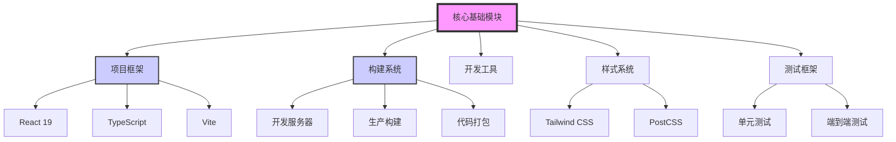

# 核心基础模块 (M-001)

## 模块概述

**模块名称**：`核心基础模块`
**模块ID**：`M-001`
**创建日期**：`2026-03-20`
**最后更新**：`2026-03-20`
**当前状态**：`✅ 已实现`
**优先级**：`P0`
**负责人**：`系统`

**模块描述**：
提供项目的基础框架和技术栈支持，包括开发环境、构建系统、代码规范和测试框架。是所有其他模块的基础依赖。

**模块职责**：
1. 项目基础框架搭建
2. 开发工具链配置
3. 代码质量和规范保障
4. 构建和部署基础
5. 跨模块共享工具和组件

## 模块架构



## 功能目录

| 功能ID | 功能名称 | 状态 | 优先级 | 负责人 | 最后更新 |
|--------|----------|------|--------|--------|----------|
| `F-001` | `项目基础框架` | ✅ 已实现 | P0 | `系统` | `2026-03-20` |
| `F-002` | `开发环境配置` | ✅ 已实现 | P0 | `系统` | `2026-03-20` |
| `F-003` | `构建系统配置` | ✅ 已实现 | P0 | `系统` | `2026-03-20` |
| `F-004` | `代码规范配置` | ✅ 已实现 | P1 | `系统` | `2026-03-20` |
| `F-005` | `测试框架集成` | 📋 规划中 | P1 | `待分配` | `2026-03-20` |
| `F-006` | `共享工具库` | 📋 规划中 | P2 | `待分配` | `2026-03-20` |
| `F-007` | `组件库基础` | 📋 规划中 | P2 | `待分配` | `2026-03-20` |
| `F-008` | `错误处理框架` | 📋 规划中 | P1 | `待分配` | `2026-03-20` |

---

## 功能详情

### 功能ID: `F-001` - `项目基础框架`

#### 基本信息
- **功能名称**：`项目基础框架`
- **功能ID**：`F-001`
- **所属模块**：`M-001` (核心基础模块)
- **创建日期**：`2026-03-20`
- **最后更新**：`2026-03-20`
- **当前状态**：`✅ 已实现`
- **优先级**：`P0`
- **负责人**：`系统`

#### 功能描述
建立项目的基础技术栈和开发环境，为后续功能开发提供稳定基础。

**用户故事**：
> 作为 `开发者`，我希望 `拥有一个现代化的前端开发环境`，以便 `高效开发和维护AI前端应用`。

**验收标准**：
- [x] 使用React + TypeScript + Vite技术栈
- [x] 集成Tailwind CSS进行样式管理
- [x] 配置ESLint和代码规范
- [x] 建立项目目录结构
- [x] 实现基本的开发服务器和构建流程

#### 依赖关系

**上游依赖**：
| 依赖项 | 类型 | 描述 | 状态 |
|--------|------|------|------|
| `Node.js环境` | 环境依赖 | `Node.js v16+ 和 npm/yarn` | ✅ 就绪 |

**下游依赖**：
| 依赖项 | 类型 | 描述 | 状态 |
|--------|------|------|------|
| `所有其他模块` | 模块依赖 | `所有模块都依赖此基础框架` | 📋 规划中 |

#### 边界条件

**输入条件**：
- 输入类型：`无`
- 输入来源：`项目初始化`
- 输入验证：`无`
- 异常处理：`构建失败时提供清晰错误信息`

**输出条件**：
- 输出类型：`可运行的开发环境`
- 输出目标：`开发者`
- 输出验证：`通过npm run dev可启动开发服务器`

**限制条件**：
- 性能要求：`开发服务器启动时间 < 5秒`
- 资源限制：`内存使用合理`
- 安全要求：`遵循前端安全最佳实践`
- 兼容性要求：`支持现代浏览器(Chrome, Firefox, Safari最新版本)`

#### 技术实现

**实现方案**：
```bash
# 项目初始化命令
npm create vite@latest frontend -- --template react-ts
npm install -D tailwindcss@^3.4.0 postcss autoprefixer
npx tailwindcss init -p
```

**关键组件**：
| 组件名称 | 职责 | 技术栈 |
|----------|------|--------|
| `Vite配置` | `构建工具和开发服务器` | `Vite` |
| `React应用` | `前端框架` | `React 19 + TypeScript` |
| `Tailwind CSS` | `样式系统` | `Tailwind CSS v3` |
| `ESLint` | `代码质量检查` | `ESLint` |

**配置项**：
| 配置键 | 默认值 | 描述 | 环境差异 |
|--------|--------|------|----------|
| `VITE_API_BASE` | `http://localhost:3000/api` | `API基础URL` | 生产环境使用实际API地址 |
| `VITE_APP_TITLE` | `AI Frontend` | `应用标题` | 无 |

#### 测试用例

**单元测试**：
- 测试场景1：`验证开发服务器可以正常启动`
- 测试场景2：`验证TypeScript编译无错误`

**集成测试**：
- 测试场景1：`验证Tailwind CSS类可以正确应用`
- 测试场景2：`验证热更新功能正常工作`

#### 变更历史

| 版本 | 日期 | 变更内容 | 变更人 |
|------|------|----------|--------|
| `v1.0.0` | `2026-03-20` | 初始版本创建 | `系统` |

#### 相关文档
- [ ] 设计文档：`PROJECT-OVERVIEW.md`
- [ ] API文档：`待创建`
- [ ] 测试报告：`待创建`
- [ ] 部署指南：`待创建`

---

### 功能ID: `F-002` - `开发环境配置`

#### 基本信息
- **功能名称**：`开发环境配置`
- **功能ID**：`F-002`
- **所属模块**：`M-001` (核心基础模块)
- **创建日期**：`2026-03-20`
- **最后更新**：`2026-03-20`
- **当前状态**：`✅ 已实现`
- **优先级**：`P0`
- **负责人**：`系统`

#### 功能描述
配置完整的开发环境，包括开发服务器、热重载、调试工具等。

**用户故事**：
> 作为 `开发者`，我希望 `拥有高效的开发工具链`，以便 `快速迭代和调试代码`。

**验收标准**：
- [x] 开发服务器支持热重载
- [x] 支持TypeScript实时编译
- [x] 集成浏览器调试工具
- [x] 环境变量配置支持
- [x] 代理配置支持

#### 技术实现
**Vite开发服务器配置**：
```javascript
// vite.config.ts
export default defineConfig({
  server: {
    port: 5173,
    host: 'localhost',
    open: true,
    cors: true,
    proxy: {
      '/api': {
        target: 'http://localhost:3000',
        changeOrigin: true,
      }
    }
  }
})
```

---

### 功能ID: `F-003` - `构建系统配置`

#### 基本信息
- **功能名称**：`构建系统配置`
- **功能ID**：`F-003`
- **所属模块**：`M-001` (核心基础模块)
- **创建日期**：`2026-03-20`
- **最后更新**：`2026-03-20`
- **当前状态**：`✅ 已实现`
- **优先级**：`P0`
- **负责人**：`系统`

#### 功能描述
配置生产环境构建系统，包括代码压缩、资源优化、分包策略等。

**验收标准**：
- [x] 生产构建支持代码压缩
- [x] 支持CSS和JavaScript代码分割
- [x] 静态资源优化处理
- [x] 生成sourcemap用于调试
- [x] 支持不同的构建目标

---

### 功能ID: `F-004` - `代码规范配置`

#### 基本信息
- **功能名称**：`代码规范配置`
- **功能ID**：`F-004`
- **所属模块**：`M-001` (核心基础模块)
- **创建日期**：`2026-03-20`
- **最后更新**：`2026-03-20`
- **当前状态**：`✅ 已实现`
- **优先级**：`P1`
- **负责人**：`系统`

#### 功能描述
配置代码规范和静态检查工具，确保代码质量和一致性。

**验收标准**：
- [x] ESLint配置支持TypeScript和React
- [x] 代码格式化规则配置
- [x] Git提交规范检查
- [x] 代码提交前自动检查
- [x] 团队协作规范统一

---

## 模块内功能依赖矩阵

| 功能ID | F-001 | F-002 | F-003 | F-004 | F-005 | F-006 | F-007 | F-008 |
|--------|-------|-------|-------|-------|-------|-------|-------|-------|
| **F-001** | - | ✅ | ✅ | ✅ | ✅ | ✅ | ✅ | ✅ |
| **F-002** | ❌ | - | 🔶 | 🔶 | 🔶 | 🔶 | 🔶 | 🔶 |
| **F-003** | ❌ | 🔶 | - | 🔶 | 🔶 | 🔶 | 🔶 | 🔶 |
| **F-004** | ❌ | 🔶 | 🔶 | - | 🔶 | 🔶 | 🔶 | 🔶 |
| **F-005** | ❌ | 🔶 | 🔶 | 🔶 | - | ✅ | ✅ | ✅ |
| **F-006** | ❌ | 🔶 | 🔶 | 🔶 | 🔶 | - | ✅ | ✅ |
| **F-007** | ❌ | 🔶 | 🔶 | 🔶 | 🔶 | 🔶 | - | ✅ |
| **F-008** | ❌ | 🔶 | 🔶 | 🔶 | 🔶 | 🔶 | 🔶 | - |

**图例**：
- ✅：强依赖（必须存在）
- 🔶：弱依赖（可选依赖）
- ❌：无依赖

## 模块接口

### 对外暴露接口
1. **构建工具接口**：`npm run dev`, `npm run build`, `npm run preview`
2. **代码规范接口**：`npm run lint`, Git预提交钩子
3. **环境配置接口**：环境变量配置文件 (`.env`)
4. **样式系统接口**：Tailwind CSS配置和工具类

### 依赖的其他模块
- **无**：本模块是基础模块，不依赖其他业务模块

### 被其他模块依赖
- **所有业务模块**：都依赖本模块提供的基础设施

## 配置管理

### 环境变量
```env
# 开发环境
VITE_APP_ENV=development
VITE_API_BASE=http://localhost:3000/api

# 生产环境
VITE_APP_ENV=production
VITE_API_BASE=https://api.example.com/api
```

### 构建配置
```javascript
// vite.config.ts
export default defineConfig({
  build: {
    target: 'es2020',
    outDir: 'dist',
    assetsDir: 'assets',
    sourcemap: true,
    minify: 'terser',
    rollupOptions: {
      output: {
        manualChunks: {
          vendor: ['react', 'react-dom'],
          utils: ['lodash', 'axios']
        }
      }
    }
  }
})
```

## 维护指南

### 模块升级
1. **技术栈升级**：定期评估和升级React、TypeScript、Vite等版本
2. **配置优化**：根据项目需求调整构建和开发配置
3. **工具集成**：评估和集成新的开发工具

### 问题排查
1. **构建失败**：检查TypeScript配置和依赖版本
2. **开发服务器问题**：检查端口占用和代理配置
3. **样式问题**：检查Tailwind CSS配置和PostCSS插件

## 附录

### 技术栈版本
| 技术 | 版本 | 说明 |
|------|------|------|
| React | 19.2.4 | 前端框架 |
| TypeScript | ~5.9.3 | 类型系统 |
| Vite | 8.0.1 | 构建工具 |
| Tailwind CSS | ^3.4.0 | 样式框架 |
| ESLint | 9.39.4 | 代码检查 |

### 参考文档
- [Vite官方文档](https://vite.dev/)
- [React官方文档](https://react.dev/)
- [Tailwind CSS文档](https://tailwindcss.com/)
- [TypeScript文档](https://www.typescriptlang.org/)

---

*本文档是核心基础模块的功能文档。所有基础功能的变更都应在此文档中记录。*